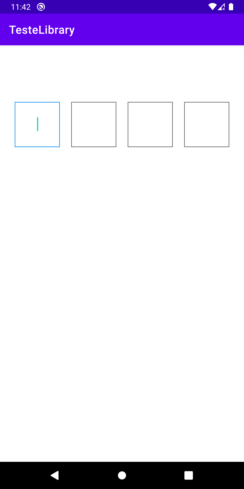

# DoubleLinkedListEditText Library

## This is a library to create a EditText based on Doubly Linked List data structure to the user be able input codes.


[](hhttps://jitpack.io/#layonmartins/DoubleLinkedListEditText/1.1.1)


## Install

**Step 1**. Add the JitPack repository to your build file
Add it in your root build.gradle at the end of repositories:
```
allprojects {
  repositories {
    ...
    maven { url 'https://jitpack.io' }
  }
}
```
**Step 2.** Add the dependency
```
dependencies {
  implementation 'com.github.layonmartins:DoubleLinkedListEditText:1.1.1'
}
```

## Usage

You can add the custom ViewGroup in your layout view by add in xml:
```xml
<?xml version="1.0" encoding="utf-8"?>
<androidx.constraintlayout.widget.ConstraintLayout xmlns:android="http://schemas.android.com/apk/res/android"
    xmlns:app="http://schemas.android.com/apk/res-auto"
    xmlns:tools="http://schemas.android.com/tools"
    android:layout_width="match_parent"
    android:layout_height="match_parent"
    tools:context=".MainActivity">

    <com.layon.doublelinkedlistlibrary.DoubleLinkedListEditText
        android:id="@+id/doubleLinkedListEditText"
        android:layout_width="wrap_content"
        android:layout_height="wrap_content"
        android:layout_margin="100dp"
        android:layout_marginTop="100dp"
        android:visibility="visible"
        android:gravity="center"
        android:orientation="horizontal"
        app:size_elements="4"
        app:element_layout_weight="80dp"
        app:element_layout_height="80dp"
        app:margin_between_elements="10dp"
        app:layout_constraintEnd_toEndOf="parent"
        app:layout_constraintHorizontal_bias="0.5"
        app:layout_constraintStart_toStartOf="parent"
        app:layout_constraintTop_toTopOf="parent">
    </com.layon.doublelinkedlistlibrary.DoubleLinkedListEditText>

</androidx.constraintlayout.widget.ConstraintLayout>
```

And in your Activity/Fragment layout you can use a CheckCodeCallbalck to listener the finally user inputs (Kotlin):

```kotlin
import androidx.appcompat.app.AppCompatActivity
import android.os.Bundle
import android.util.Log
import com.layon.doublelinkedlistlibrary.DoubleLinkedListEditText

class MainActivity : AppCompatActivity() {

    var TAG = "layon.f - MainActivity"

    override fun onCreate(savedInstanceState: Bundle?) {
        super.onCreate(savedInstanceState)
        setContentView(R.layout.activity_main)

        val doubleLinkedListEditText: DoubleLinkedListEditText = findViewById(R.id.doubleLinkedListEditText)

        doubleLinkedListEditText.setCheckCodeCallback( object :
            com.layon.doublelinkedlistlibrary.CheckCodeCallback {
            override fun checkCode(code: String) {
                if (code == "1234"){
                    Log.d(TAG, "checkCode success")
                    doubleLinkedListEditText.setSuccessBackground()
                    //do whatever you want
                } else {
                    Log.d(TAG, "checkCode fail")
                    doubleLinkedListEditText.setErrorBackground()
                }
            }
        })
    }
}
```

## Image




## Technologies

* Kotlin
* DoubleLinkedList data structure
* EditText
* Android module library